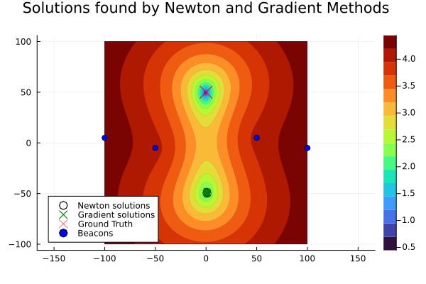

# Assignment 2 — Eigenvalues, Newton's Method & Optimization

Iterative eigenvalue methods, root-finding, and optimization implemented in Julia.

**Implemented**
- Power method for extremal eigenvalues of symmetric matrices, with convergence bound via the Bauer–Fike theorem
- Newton's method for root-finding, extended to the multivariate case
- A localization problem solved by comparing Newton and gradient-based methods against beacon position data

**Files**
- `madeline_lebreton_a2.jl` — implementation
- `madeline_lebreton_a2.pdf` — write-up with derivations, error analysis, and plots
- `figures/` — supporting plots

