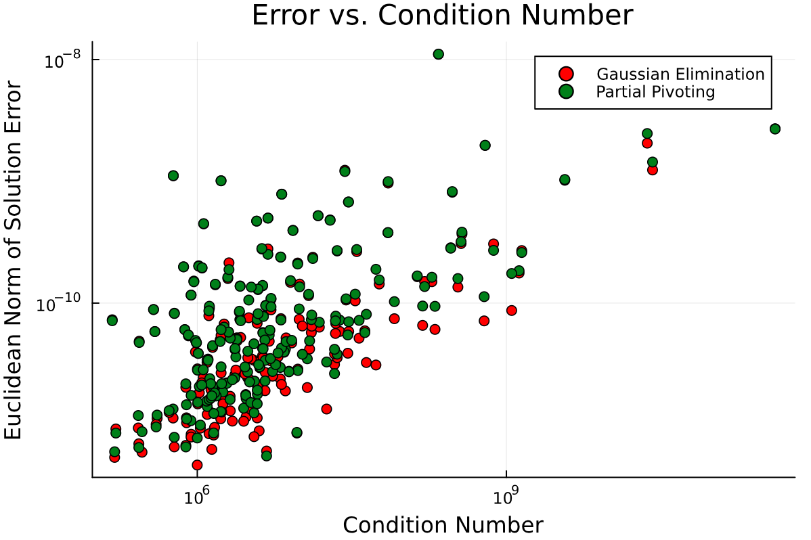

# Assignment 1 — Floating Point Computation & Direct Linear System Solvers

Analysis of floating-point error and a from-scratch direct linear solver in Julia.

**Implemented**
- Backward substitution for upper-triangular systems
- Gaussian elimination, with and without partial pivoting
- Benchmarking of solution error against matrix condition number across hundreds of randomly generated linear systems

**Files**
- `madeline_lebreton_a1.jl` — implementation
- `madeline_lebreton_a1.pdf` — write-up with derivations, error analysis, and plots
- `figures/` — supporting plots

